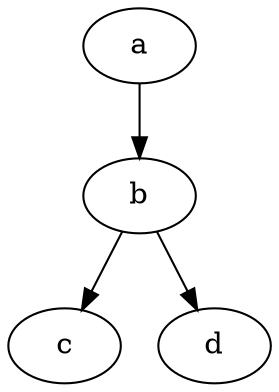
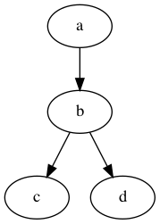

> Your eighth assignment requires that you have read and understand
> [Code that writes code](./08-lesson.md).

## Overview

In this assignment, you will learn how to use Go's [ast][1] package and
write a program that produces a [DOT][2] visualization of your application.

  [1]: https://golang.org/pkg/go/ast
  [2]: https://graphviz.org/doc/info/lang.html

## 1 Load packages

Your first task is to create a program in the `cmd/dot` directory that loads
Go packages into an `*types.Package` and prints out each of the loaded package
names. the If your program fails to parse any of the packages, it should return
a non-zero exit code.

Example use of this program is shown below:

```sh
$ go run ./cmd/dot/main.go github.com/amckinney/issue-tracker/internal/controller/issue
Loaded package with name "issue".
```

## 2 DOT graph

Now that you have a simple setup for loading packages, your next task is to use
the loader you created in [1 Load packages](#1-load-packages) and write a [DOT][2]
visualization of the import graph.

Your program should traverse each of the packages imported by the top-level
`*packages.Package` (via the `*packages.Package.Imports`), and create a *directed
edge* between each package and its imports.

You can create a *directed graph* with the `digraph` keyword in a `imports.dot` file
like so:



The visualization this yields with the `dot` command is shown below:

```sh
$ cat imports.dot | dot -Tpng -o graph.png
$ open graph.png
```

  

In your solution, each node should be a fully-qualified import path, which can be
resolved by the `*packages.Package.PkgPath` field.

> You are welcome to use OSS solutions for writing `DOT` files if you prefer.
> Check out [go-graphviz][3] for inspiration!

  [3]: https://github.com/goccy/go-graphviz

## Submitting

Notify your mentor that you have created the pull requests in the `issue-tracker`
repository. Your mentor will review your code and assign a grade before your next
weekly check-in.
